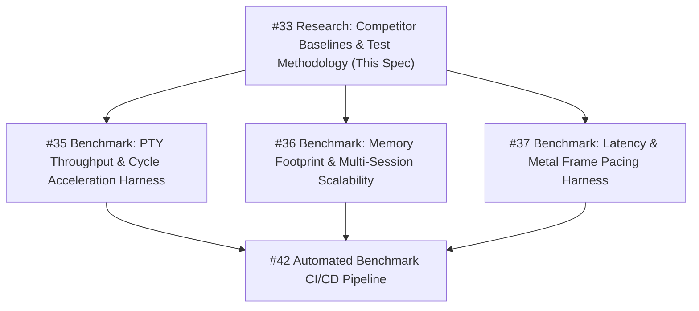

# SwarmDeck Benchmark Baselines & Test Methodology Specification

- **Document ID:** `SWARM-SPEC-BENCH-001`
- **Target Version:** SwarmDeck 1.0 (Phase 3 Frontier)
- **Status:** Approved Baseline Specification
- **Primary Issue:** [#33 (Research: Competitor Benchmarks Baseline & Test Methodology)](https://github.com/RafaelScharf/SwarmDeck/issues/33)
- **Downstream Implementations:** [#35 (PTY Throughput Harness)](https://github.com/RafaelScharf/SwarmDeck/issues/35), [#36 (Memory Footprint Harness)](https://github.com/RafaelScharf/SwarmDeck/issues/36), [#37 (Latency & Frame Pacing Harness)](https://github.com/RafaelScharf/SwarmDeck/issues/37), [#42 (Benchmark Integration Pipeline)](https://github.com/RafaelScharf/SwarmDeck/issues/42)
- **Date:** 2026-09-08

---

## 1. Executive Summary & Architectural Imperative

SwarmDeck is a native macOS graphical terminal multiplexer engineered explicitly for parallel autonomous AI coding agents (such as Claude Code, Aider, Antigravity, and Codex CLI). 

Unlike human-driven terminal sessions—which remain idle 99% of the time with occasional keystrokes—autonomous agent sessions generate **continuous, bursty, multi-megabyte I/O streams**, execute simultaneous background tool calls, produce large context diffs, and prompt for human approval at unpredictable intervals.

When running 5 to 20 parallel agent sessions:
1. **Web and Electron-based wrappers (e.g., Superset, Claude Code Desktop wrappers, xterm.js)** degrade severely: memory balloons past 1–2 GB of Dirty RAM, Chromium V8 garbage collection (GC) triggers multi-frame freezes, and CPU usage causes thermal throttling and battery drain.
2. **Traditional native terminals (iTerm2)** accumulate significant per-session Cocoa/AppKit view overhead, CPU-bound ANSI parsing, and lack agent-aware state streaming.
3. **GPU-native terminal engines (Ghostty, Alacritty)** deliver stellar rendering and raw PTY performance, but are designed as single-session terminals without multi-agent session supervision, state detection, or unified workspace orchestration.

**SwarmDeck's Architectural Thesis:**
By coupling a pure Swift AppKit/SwiftUI interface and Swift 6 Concurrency supervision engine with the high-performance C/Zig Metal terminal engine (**`libghostty`**), SwarmDeck achieves the absolute highest throughput, lowest latency, and minimal memory footprint in the AI agent multiplexer category.

This specification sets the **empirical baseline targets** and **exact testing methodologies** required to scientifically prove and maintain this architectural superiority.

---

## 2. Competitor Landscape & Architectural Breakdown

| Competitor | Engine / UI Stack | Rendering Pipeline | PTY & Stream Model | Multi-Agent Suitability |
| :--- | :--- | :--- | :--- | :--- |
| **Superset / Claude Desktop** | Electron (Chromium + Node.js) | DOM / Canvas / WebGL (`xterm.js`) | Multi-process IPC (`node-pty` $\to$ Chromium IPC $\to$ WebGL) | **Poor:** Severe memory bloat, high GC latency jitter, CPU spikes under parallel logging. |
| **iTerm2** | Objective-C / AppKit (Cocoa) | Metal / CPU Fallback | Posix PTY $\to$ Cocoa RunLoop reader | **Moderate:** Highly customizable, but high per-tab memory overhead and CPU bottlenecks during raw ANSI flood. |
| **Alacritty** | Rust / Winit | OpenGL / Metal (winit) | Dedicated PTY reader thread $\to$ Mutex ring-buffer | **High (Raw):** Minimalist and fast, but lacks tabs/multiplexing, session management, or semantic agent detection. |
| **Ghostty** | Zig / AppKit | Direct Metal Shaders (Apple Silicon optimized) | Zero-copy SIMD VT parser $\to$ Lock-free render queue | **State of the Art (Terminal):** Industry benchmark for terminal rendering and latency, but single-window oriented. |
| **Warp** | Rust / Proprietary | Custom Metal Canvas UI | Custom PTY $\to$ Block-based buffer engine | **Moderate:** Modern block model, but high baseline memory footprint (~200MB+), telemetry overhead, proprietary stack. |
| **SwarmDeck (Target)** | **Native Swift + libghostty** | **Hardware Metal Shaders (`libghostty`)** | **`PTYStreamCoalescer` (AsyncStream) + Zero-Copy State Detector** | **Optimized:** Native macOS UX, sub-60MB idle, sub-6MB/session, sub-3ms prompt detection, 120 FPS ProMotion. |

---

## 3. Empirical Benchmark Baselines & Targets Matrix

All figures represent macOS Sonoma/Sequoia running on Apple Silicon (M1/M2/M3/M4 Pro/Max architectures).

| Metric | Electron / Superset | iTerm2 (Metal) | Alacritty | Ghostty | Warp | SwarmDeck Target | Hard Limit (CI Fail) |
| :--- | :--- | :--- | :--- | :--- | :--- | :--- | :--- |
| **Idle Dirty RAM (0 sessions)** | 350 – 650 MB | 85 – 140 MB | 35 – 55 MB | 28 – 45 MB | 180 – 300 MB | **< 60 MB** | `> 80 MB` |
| **Incremental RAM per Session** | 40 – 75 MB | 18 – 35 MB | 6 – 12 MB | 4 – 8 MB | 25 – 45 MB | **< 6 MB** | `> 10 MB` |
| **10 Parallel Sessions RAM** | 750 – 1,400 MB | 260 – 480 MB | 95 – 175 MB | 68 – 125 MB | 450 – 750 MB | **< 120 MB** | `> 180 MB` |
| **20 Parallel Sessions RAM** | 1,500 – 2,800 MB | 500 – 950 MB | 150 – 290 MB | 110 – 205 MB | 850 – 1,600 MB | **< 200 MB** | `> 300 MB` |
| **Typing Latency (p50 median)** | 38 – 75 ms | 18 – 35 ms | 5 – 12 ms | 4 – 10 ms | 18 – 35 ms | **< 15 ms** | `> 25 ms` |
| **Typing Latency (p99 tail)** | 85 – 160 ms | 45 – 90 ms | 14 – 25 ms | 10 – 18 ms | 40 – 80 ms | **< 25 ms** | `> 40 ms` |
| **PTY Throughput (`termbench`)** | 12 – 28 MB/s | 25 – 55 MB/s | 80 – 150 MB/s | 75 – 140 MB/s | 30 – 60 MB/s | **> 65 MB/s** | `< 45 MB/s` |
| **Frame Pacing (120 Hz Target)** | 30 – 60 FPS (drops) | 60 – 120 FPS | 120 FPS | 120 FPS | 120 FPS | **120 FPS (0 drops)** | `> 2 drops/sec` |
| **Frame Delta Jitter ($\sigma$)** | > 8.0 ms | 2.5 – 5.0 ms | < 0.8 ms | < 0.3 ms | 1.2 – 2.5 ms | **< 0.5 ms** | `> 1.5 ms` |
| **Agent State Turnaround** | N/A (Manual) | N/A | N/A | N/A | N/A | **< 3 ms** | `> 10 ms` |
| **Idle Background CPU (10 sess.)**| 3.5% – 8.0% | 0.8% – 2.0% | N/A | N/A | 1.5% – 4.0% | **< 0.5%** | `> 1.5%` |

---

## 4. Rigorous Metric Protocols & Testing Methodologies

### Protocol A: Input-to-Display Typing Latency (Dan Luu & Typometer Methodology)

#### 1. Objective
Measure the round-trip latency elapsed between a user keypress event and the physical pixel presentation of the corresponding glyph on screen, both at idle and under background streaming load.

#### 2. Theoretical Framework
Following Dan Luu's empirical latency methodology and the Typometer terminal benchmark:
$$\text{Total Latency } T_{\text{total}} = T_{\text{event}} + T_{\text{pty\_write}} + T_{\text{process\_echo}} + T_{\text{pty\_read}} + T_{\text{grid\_parse}} + T_{\text{render\_encode}} + T_{\text{gpu\_present}}$$

For SwarmDeck:
- Keystroke injection occurs via synthetic `CGEvent` or direct PTY master write (`write(masterFd)`).
- Timestamp $t_0$ is recorded using high-resolution hardware timers (`mach_absolute_time()`).
- The terminal engine processes the echoed character into the screen grid.
- Completion timestamp $t_1$ is captured at the Metal command buffer presentation callback:
  ```swift
  commandBuffer.addCompletedHandler { _ in
      let t1 = mach_absolute_time()
      recordLatency(t1 - t0)
  }
  ```

#### 3. Test Procedure
1. **Idle Keystroke Run:** Inject 1,000 ASCII keypresses at randomized intervals between 50ms and 150ms.
2. **Loaded Keystroke Run:** Inject 1,000 ASCII keypresses while 4 background sessions are actively receiving 10 MB/s synthetic ANSI compilation streams.
3. Compute metrics:
   - Median ($p_{50}$)
   - 95th percentile ($p_{95}$)
   - 99th percentile ($p_{99}$)
   - Standard deviation ($\sigma$) and maximum tail latency ($t_{\max}$).

#### 4. Pass Criteria
- Idle: $p_{50} \le 12\text{ ms}$, $p_{99} \le 20\text{ ms}$.
- Under 4-session background streaming: $p_{50} \le 15\text{ ms}$, $p_{99} \le 25\text{ ms}$.

---

### Protocol B: Dirty Memory Footprint & Scaling (`footprint` & `vm_stat`)

#### 1. Objective
Quantify private dirty memory consumed by the SwarmDeck application process across idle state, incremental session allocation (1, 5, 10, 20 sessions), and post-scrollback stress testing.

#### 2. Why "Dirty Memory" Matters on macOS
On macOS, traditional metrics like Virtual Memory (`VSZ`) or Resident Set Size (`RSS`) are highly misleading:
- `VSZ` includes mapped read-only dynamic libraries, system frameworks, and file mappings.
- `RSS` includes purgeable and shared pages that the kernel reclaims under pressure.
- **Dirty Memory (`footprint`)** measures the actual unevictable RAM allocated to heap allocations, anonymous malloc zones, JIT pages, and dirty Metal buffers. When dirty memory exceeds physical limits, macOS forces memory compression or terminates processes (`EXC_RESOURCE / MEMORY`).

#### 3. Test Procedure
The automated harness executes the following phased sequence:
```
Phase 1: Cold Launch -> Wait 5s quiescence -> Measure Idle Footprint
Phase 2: Spawn Session 1 -> Wait 2s -> Measure Footprint
Phase 3: Spawn Sessions 2..5 (Total 5) -> Wait 2s -> Measure Footprint
Phase 4: Spawn Sessions 6..10 (Total 10) -> Wait 2s -> Measure Footprint
Phase 5: Spawn Sessions 11..20 (Total 20) -> Wait 2s -> Measure Footprint
Phase 6: Flood all 20 sessions with 50,000 lines ANSI scrollback -> Measure Peak Footprint
Phase 7: Quiescence cooldown 10s -> Trigger memory sweep -> Measure Retained Footprint
```

#### 4. Measurement Tooling & Command
Run Apple's native diagnostic utility against the SwarmDeck PID:
```bash
footprint -p <PID> -json > footprint_report.json
```
Extract `dirty_size`, `compressed_size`, and malloc breakdown:
$$\text{Effective Footprint} = \text{dirty\_size} + \text{compressed\_size}$$

#### 5. Pass Criteria
- $\text{Footprint}_{\text{idle}} < 60\text{ MB}$.
- $\Delta \text{Footprint}_{\text{session}} \le 6\text{ MB / session}$ (up to 20 sessions).
- $\text{Footprint}_{10\text{ sessions}} < 120\text{ MB}$.
- $\text{Footprint}_{20\text{ sessions}} < 200\text{ MB}$.
- Zero cumulative memory growth across Phase 6 $\to$ Phase 7 cooldown (no memory leaks).

---

### Protocol C: 120 FPS ProMotion Frame Pacing & Jitter Protocol

#### 1. Objective
Ensure buttery-smooth 120 Hz rendering on Apple Silicon ProMotion displays (Liquid Retina XDR) without dropped frames or visual stuttering during high-speed agent streaming.

#### 2. Theoretical Framework
At 120 Hz, the display refreshes every **8.333 milliseconds**:
$$T_{\text{frame\_budget}} = \frac{1}{120\text{ s}^{-1}} \approx 8.333\text{ ms}$$

If any frame takes longer than $1.25 \times T_{\text{budget}} \approx 10.42\text{ ms}$ to complete and present, a **frame drop** occurs, causing visible micro-stuttering.

#### 3. Test Procedure
1. Hook into the display rendering loop via `CADisplayLink` or `CVDisplayLink` callback:
   ```swift
   func displayLinkDidFire(displayLink: CADisplayLink) {
       let targetTimestamp = displayLink.targetTimestamp
       let actualTimestamp = CACurrentMediaTime()
       let delta = actualTimestamp - lastFrameTimestamp
       lastFrameTimestamp = actualTimestamp
       recordFrameDelta(delta)
   }
   ```
2. Run continuous test for 60 seconds (7,200 expected frames) while:
   - Foreground session: Streaming high-density colored text (`termbench` pattern).
   - 4 Background sessions: Actively streaming background agent build logs.
3. Compute frame stability metrics:
   $$\text{Dropped Frames} = \sum [ \Delta t_i > 10.42\text{ ms} ]$$
   $$\text{Jitter } \sigma = \sqrt{ \frac{1}{N} \sum_{i=1}^N (\Delta t_i - \bar{\Delta t})^2 }$$

#### 4. Pass Criteria
- Total dropped frames over 60 seconds: **0 frames**.
- Frame delta standard deviation $\sigma < 0.5\text{ ms}$.
- Zero visual tearing verified via Metal frame capture.

---

### Protocol D: PTY Throughput & Ingestion Harness (`termbench` Protocol)

#### 1. Objective
Stress-test the POSIX pseudo-terminal (PTY) ingestion pipeline and the `PTYStreamCoalescer` under continuous high-volume data streams without UI lockups, memory runaway, or dropped bytes.

#### 2. Synthetic Test Stream Workloads
The benchmark harness simulates realistic and adversarial terminal streams:
1. **Raw UTF-8 Stream:** Dense text, 80 to 200 columns wide.
2. **24-bit TrueColor ANSI Matrix:** Multi-colored formatting escape codes:
   `\x1b[38;2;<r>;<g>;<b>mHello World\x1b[0m`
3. **Cursor Repositioning & Selective Erasure:** Emulating full-screen TUI tools (htop, vim, diff views):
   `\x1b[H\x1b[2J\x1b[<row>;<col>H`
4. **Massive Git Diffs:** 50,000-line syntax-highlighted diff bursts.

#### 3. Test Procedure
1. Launch `PTYService` connected to an automated generator process piping synthetic ANSI data directly through the slave PTY.
2. Transfer $100\text{ MB}$ of synthetic data in bursts.
3. Measure:
   $$\text{Throughput} = \frac{\text{Total Bytes Transferred (MB)}}{\text{Total Elapsed Time (seconds)}} \ge 65\text{ MB/s}$$
4. Monitor backpressure queue depth in `PTYStreamCoalescer` (`AsyncStream` buffer capacity = 2000, `maxBufferSize` = 64 KB).
5. Verify zero dropped bytes and correct VT sequence parsing upon stream completion.

#### 4. Pass Criteria
- Sustained throughput $> 65\text{ MB/s}$.
- Maximum memory spike during 100 MB burst: $< 30\text{ MB}$.
- UI remains responsive (Main thread latency $< 16\text{ ms}$).

---

### Protocol E: In-Stream Agent Prompt Detection Turnaround Protocol

#### 1. Objective
Measure the exact latency from the instant an autonomous agent emits a prompt requiring human input (e.g. `[y/N]`, `Allow command execution?`, `❯`, OSC 133 semantic prompt) until SwarmDeck detects the state transition, updates the sidebar indicator, and issues a user notification.

#### 2. Test Procedure
1. Feed high-throughput simulated agent output (compilation logs, file searches) through `AgentStateDetector`.
2. At randomized intervals, inject prompt triggers into the stream:
   - Case 1: Semantic prompt marker `\x1b]133;B\x07` (instant idle).
   - Case 2: Terminal bell `\x07` (instant alert).
   - Case 3: Blocked confirmation prompt: `Do you want to run this command? (y/n)`.
   - Case 4: Shell interactive prompt `❯ `.
3. Timestamp $t_{\text{in}}$ at byte arrival in `AgentStateDetector.feed(data:)`.
4. Timestamp $t_{\text{out}}$ inside `onStateChangeCallback(newState)`.
5. Compute turnaround latency:
   $$\Delta t_{\text{detection}} = t_{\text{out}} - t_{\text{in}}$$

#### 4. Pass Criteria
- Semantic marker / bell detection latency: $< 0.5\text{ ms}$.
- Regex sliding tail buffer detection latency: $< 3.0\text{ ms}$.
- Zero false positives on continuous standard compiler warning/error streams.

---

## 5. CI/CD Automated Guardrails & Thresholds

To prevent performance regressions during rapid development, the following thresholds are enforced in the CI/CD pipeline (`make benchmark` / GitHub Actions runner):

| Benchmark Test | Soft Warning Threshold | Hard Failure Threshold (Exit 1) |
| :--- | :--- | :--- |
| **Idle Dirty RAM** | $> 50\text{ MB}$ | $> 80\text{ MB}$ |
| **Incremental RAM per Session** | $> 5.5\text{ MB}$ | $> 10.0\text{ MB}$ |
| **10 Sessions Dirty RAM** | $> 100\text{ MB}$ | $> 180\text{ MB}$ |
| **Typing Latency (p50)** | $> 12\text{ ms}$ | $> 25\text{ ms}$ |
| **Typing Latency (p99)** | $> 20\text{ ms}$ | $> 40\text{ ms}$ |
| **PTY Throughput** | $< 70\text{ MB/s}$ | $< 45\text{ MB/s}$ |
| **Frame Drops (60s @ 120Hz)** | $> 0\text{ frames}$ | $> 2\text{ frames}$ |
| **State Detection Turnaround** | $> 2.0\text{ ms}$ | $> 10.0\text{ ms}$ |

---

## 6. Downstream Implementation Roadmap

This specification immediately unblocks and directs the three Phase 3 performance harnesses:



1. **Issue #35 (`Benchmark: PTY Throughput & Cycle Acceleration Harness`):**
   - Implement `Benchmarks/PTYThroughput/` using synthetic ANSI generators.
   - Implement automated throughput measurement and backpressure verification according to **Protocol D** and **Protocol E**.
2. **Issue #36 (`Benchmark: Memory Footprint & Multi-Session Scalability Harness`):**
   - Implement `scripts/benchmark_footprint.sh` / `Benchmarks/MemoryFootprint/` wrapping Apple's `footprint` and `vm_stat` according to **Protocol B**.
   - Measure 1, 5, 10, 20 sessions and export structured JSON metrics.
3. **Issue #37 (`Benchmark: Latency & Metal Frame Pacing Harness`):**
   - Implement `Benchmarks/LatencyPacing/` utilizing `CADisplayLink` hooks and Metal completion timestamping according to **Protocol A** and **Protocol C**.
